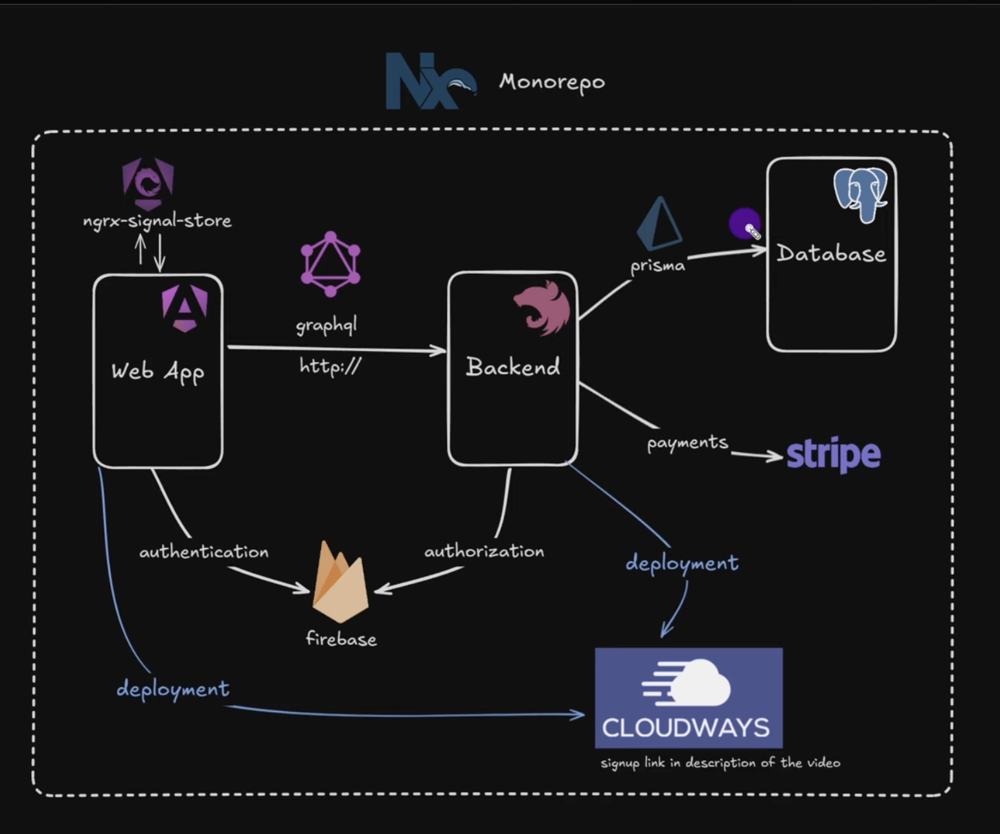

# Ecommerce

## Architecture



## Steps

### Video 1: https://www.youtube.com/watch?v=E1wtzB0ZSgQ&t

#### 1. Setup Nx workspace

```bash
npm add --global nx
```

### 2. Create a NestJS application in the workspace

- https://nx.dev/docs/technologies/node/nest/introduction

```bash
npx create-nx-workspace@latest
nx add @nx/nest
nx g @nx/nest:app apps/<name>
```

```
root -> where nx is located
    apps
        backend -> where nestjs is
```

3. Add GraphQL to NestJS
4. Add prisma to NestJS app and connect with Postgres DB
5. Add a seed command to create products in DB
6. Create the frontend (Angular)
7. Setup tailwind CSS
8. Add NgRx signal store & create ProductsStore
9. Ann angular-apollo for GraphQL queries
10. Implement getting products API call

##
